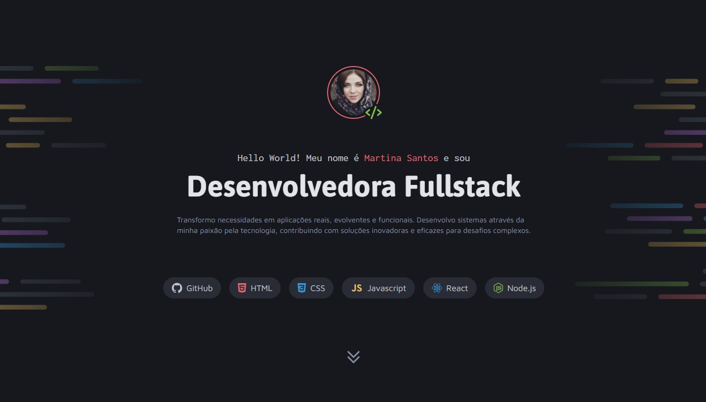

# Portifólio Dev

Um portfólio de uma desenvolvedora 'Martina Santos', destacando seus principais projetos e habilidades técnicas. Desenvolvido como parte de um desafio prático do curso Fullstack da Rocketseat, 
o trabalho reflete o domínio das ferramentas e tecnologias aprendidas, com foco em design responsivo, funcionalidade intuitiva e organização de código.

## 🛠️ Construído com

*  Construção da estrutura
*  Estilização da página

## ✒️ Autores

* **Línicker Ostroski Mota** 
